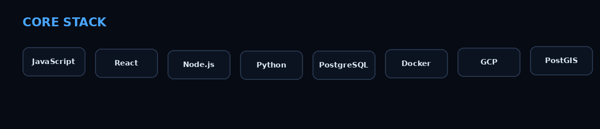
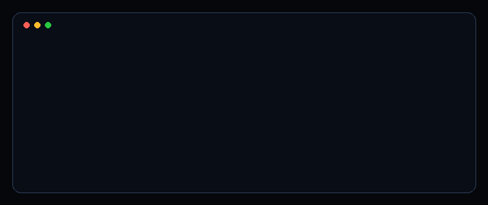

# 

<div align="center">

### Full Stack Engineer · Web · Backend · Cloud · Geospatial

Building practical software systems and web applications, with geospatial technology as a domain advantage.

[](https://github.com/Sahilprashar02)
[](https://www.linkedin.com/)

</div>


## ⚡ What I Build

```text
Frontend        → React • JavaScript • responsive interfaces
Backend         → Node.js • Python • REST APIs • authentication
Data            → PostgreSQL • PostGIS • data workflows
Cloud / DevOps  → GCP • Docker • Linux • automation
Domain          → Geospatial / GIS / enterprise applications
```

## 🧠 Core Stack

<p align="center">
  
</p>

## 💻 Current Engineering Mode

<p align="center">
  
</p>

## 🚀 Featured Work

> Replace the placeholders below with your strongest repositories. Keep 4–6 projects here and make each repository README polished.

| Project | Focus | Stack |
|---|---|---|
| **Project One** | Full-stack application | React · Node.js |
| **Project Two** | Backend / API system | Node.js · PostgreSQL |
| **Project Three** | Python / automation | Python · GCP |
| **Project Four** | Geospatial application | PostGIS · Web GIS |

## 📊 GitHub Activity

<p align="center">
  
  
</p>

## 🐍 Contribution Snake

<p align="center">
  <picture>
    <source media="(prefers-color-scheme: dark)" srcset="./github-snake/github-snake-dark.svg">
    <source media="(prefers-color-scheme: light)" srcset="./github-snake/github-snake.svg">
    
  </picture>
</p>


## ✍️ Writing

I write about JavaScript, Node.js, Express, asynchronous programming, REST APIs, authentication, and backend engineering.

- JavaScript fundamentals
- Async / Await and Promises
- Node.js internals
- Express and REST API design
- JWT authentication
- File uploads and backend workflows

## 🌍 Domain Advantage

My primary identity is **Full Stack Engineer**. I work in a GIS-related company, which gives me additional experience with geospatial systems, spatial databases, mapping workflows, and enterprise GIS.

That means I can work across:

**software engineering ↔ backend systems ↔ cloud ↔ geospatial applications**

## 📫 Connect

<p align="center">
  <a href="https://github.com/Sahilprashar02">
    
  </a>
  <a href="https://www.linkedin.com/">
    
  </a>
</p>

<p align="center">
  <i>Build. Break. Learn. Ship. Repeat.</i>
</p>
