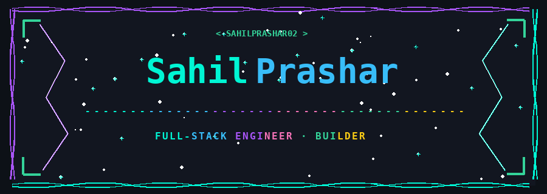
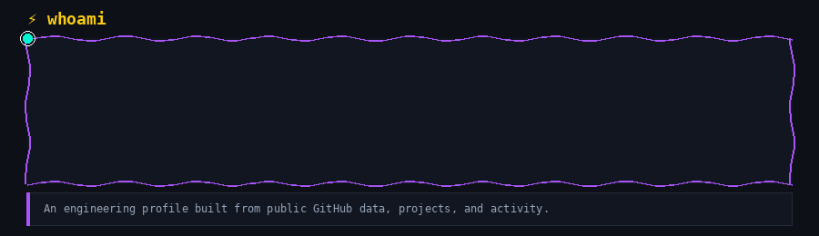
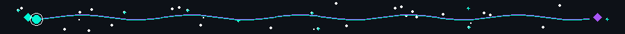
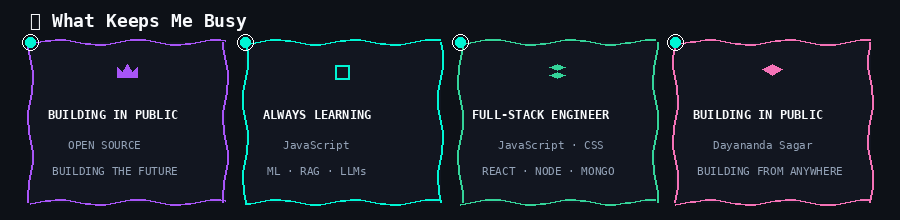
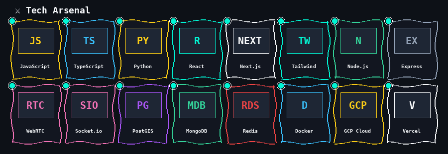
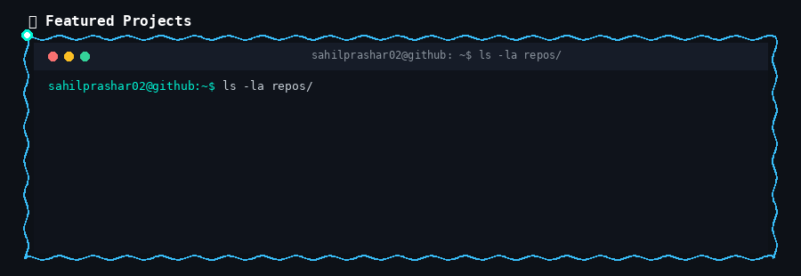

  

  

  

  

  

  

| Category | Technologies & Skills |
| :-- | :-- |
| **Languages** |    |
| **Frontend** |    |
| **Backend & Real-Time** |     |
| **Databases & Spatial** |     |
| **DevOps & Infrastructure** |     |

  

  

| Project | Description | Live Hosted Link | Tools & Technologies |
| :-- | :-- | :--: | :-- |
| 📹 **TeamBaithak** | Real-time WebRTC video conferencing & team collaboration platform. |  | `React` · `Next.js` · `Node.js` · `WebRTC` |
| 💼 **Job Finder** | Full-stack recruitment portal with candidate tracking & filters. |  | `React` · `Node.js` · `Express` · `REST` |
| ⏱️ **Time Arena** | Interactive productivity & focus management suite. |  | `JavaScript` · `React` · `CSS3` |
| 🌐 **How The Web Works** | Deep-dive guide exploring web architecture & HTTP internals. |  | `Web Architecture` · `HTTP` · `Networking` |
| 🎨 **Personal Portfolio** | Full-stack engineer showcase featuring projects & experience. |  | `Next.js` · `React` · `Tailwind` |

  

## 📊 GitHub Stats & Commit Streaks

  
  
  

  

## 🐍 Contribution Activity Trail

  <picture>
    <source media="(prefers-color-scheme: dark)" srcset="https://raw.githubusercontent.com/Sahilprashar02/Sahilprashar02/github-snake/github-snake-dark.svg">
    <source media="(prefers-color-scheme: light)" srcset="https://raw.githubusercontent.com/Sahilprashar02/Sahilprashar02/github-snake/github-snake.svg">
    
  </picture>

---

  
  
  

    

  <h3>🤝 Let's Build Something Meaningful</h3>
  
<i>Open to meaningful collaborations, useful products, and ambitious ideas.</i>

   

  <i>Build with intent. Learn in public. Ship what matters.</i>

